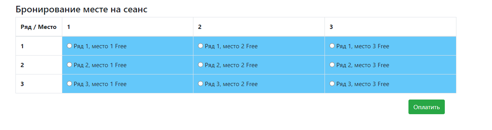
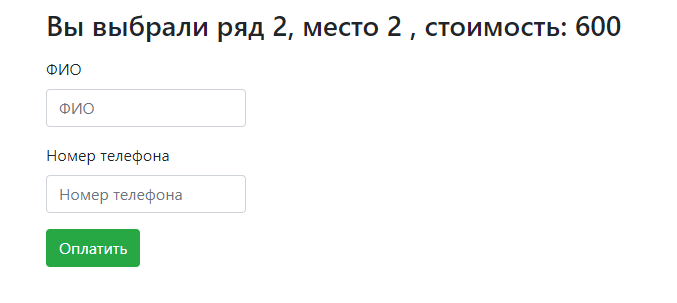
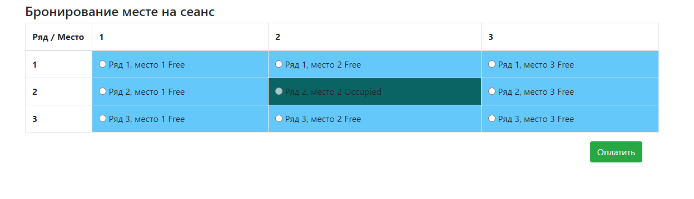

# job4j_cinema

Technologies:
- Servlets
- Simple HTML/JS(JQueue|Ajax)/CSS
- JDBC
- Apache Tomcat
- OOP
- slf4j/log4j
- PostgreSQL
- Travis CI / CodeCov / CheckStyle

This app demonstrates loading data to a page without reloading this page when booking tickets

Interface in my Application 

